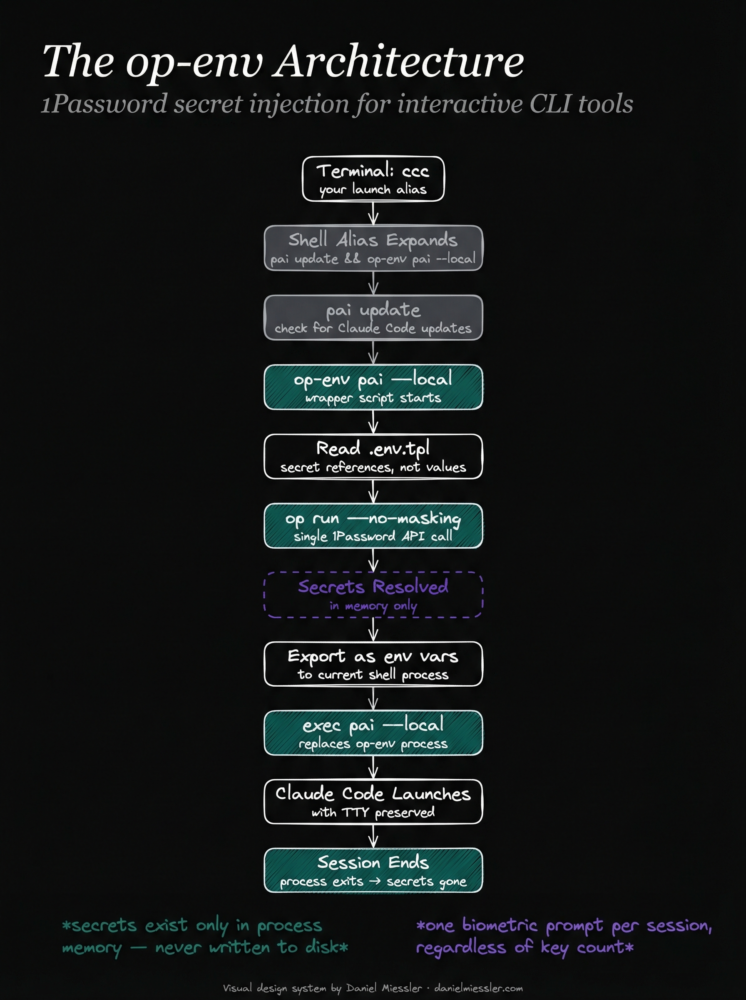
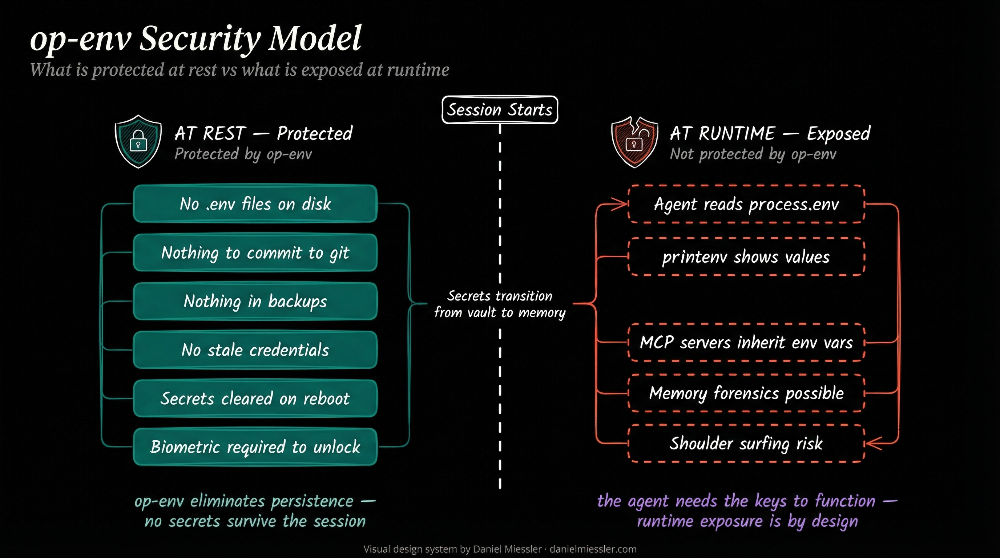

# op-env

A 17-line bash wrapper that injects 1Password secrets into interactive CLI tools — without writing secrets to disk or breaking terminal interactivity.

Built for AI coding agents (Claude Code, Cursor, Aider) that need API keys at runtime but also need a real terminal (TTY) to function.

## About me

My name is Drew and I'm a [PAI](https://github.com/danielmiessler/PAI) user learning AI engineering, not a seasoned developer, systems engineer, or security expert. I built this to solve a real problem in my own setup — I needed API keys available to Claude Code without putting secrets in `.env` files, dotfiles, or anywhere on disk — and the standard approaches (`op run`, env exports, dotenv) all had deal-breaking limitations for interactive TUI applications.

Although this architecture was built for PAI users, the underlying pattern — a bash wrapper that resolves 1Password secrets and executes an interactive command with TTY preserved — is general enough to adapt to any framework or AI coding agent workflow. If you're not using PAI, the op-env script and template format work with anything.

I figured it was worth sharing because the problem is common and the solution is small enough to understand in a few minutes. If you see ways to improve it — or if I'm doing something fundamentally wrong from a security perspective — I'd genuinely appreciate the feedback. The PAI community and the broader developer community have far more experience than I do, and I'm here to learn.

## How it works

`op-env` resolves all `op://` secret references from a template file in a single 1Password API call, exports them as environment variables, then `exec`s the target command so the process inherits the terminal's TTY directly. Secrets exist only in process memory for the duration of the session. When the session ends, the process exits, and the secrets are gone.



## Quick start

```bash
# 1. Clone and install
git clone https://github.com/DAESA24/op-env.git
cd op-env
./install.sh

# 2. Create your secret template at ~/.claude/.env.tpl
#    (see templates/env.tpl.example for the format)
cp templates/env.tpl.example ~/.claude/.env.tpl
#    Edit with your actual 1Password UUIDs

# 3. Use it
op-env <your-command> [args...]

# Example: launch Claude Code with secrets injected
op-env claude

# Use a different template
op-env --tpl ~/projects/other/.env.tpl claude
```

## Why UUIDs instead of names

Early versions of this template used human-readable vault and item names (`op://My Vault/OpenAI Key/credential`). This caused intermittent failures — renaming a vault or item in 1Password silently broke the reference, and names with special characters or whitespace produced hard-to-debug resolution errors. UUIDs are stable, unambiguous, and survive renames.

```bash
# Find your vault UUIDs
op vault list --format=json | jq '.[] | {id, name}'

# Find item UUIDs in a vault
op item list --vault <vault-uuid> --format=json | jq '.[] | {id, title}'
```

## The script

The entire tool is a small bash script:

```bash
#!/bin/bash
# Template path: --tpl flag > OP_ENV_TPL env var > default
if [ "$1" = "--tpl" ] && [ -n "$2" ]; then
  TPL="$2"
  shift 2
else
  TPL="${OP_ENV_TPL:-${HOME}/.claude/.env.tpl}"
fi

if [ ! -f "$TPL" ]; then
  echo "op-env: template not found: $TPL" >&2
  exit 1
fi

KEYS=$(grep -v '^#' "$TPL" | grep -v '^$' | cut -d= -f1 | tr '\n' '|' | sed 's/|$//')

while IFS='=' read -r key value; do
  export "$key=$value"
done < <(op run --no-masking --env-file "$TPL" -- env 2>/dev/null | grep -E "^($KEYS)=")

exec "$@"
```

No dependencies beyond bash and the 1Password CLI. The template path defaults to `~/.claude/.env.tpl` but can be overridden with `--tpl /path/to/template` or the `OP_ENV_TPL` environment variable.

## Security model

`op-env` protects secrets at rest — nothing on disk, ever. It does not and cannot protect secrets at runtime, because the agent needs them to function. The threat model is "reduce blast radius and eliminate persistence," not "prevent all access."



For the full threat analysis — including what `op-env` protects against, what it doesn't, design decisions, the complete setup guide, and troubleshooting — see **[docs/architecture.md](docs/architecture.md)**.

## Requirements

- macOS (tested on Sequoia)
- [1Password](https://1password.com) desktop app with biometric unlock
- [1Password CLI](https://developer.1password.com/docs/cli) (`op`)
- bash or zsh

## License

MIT
