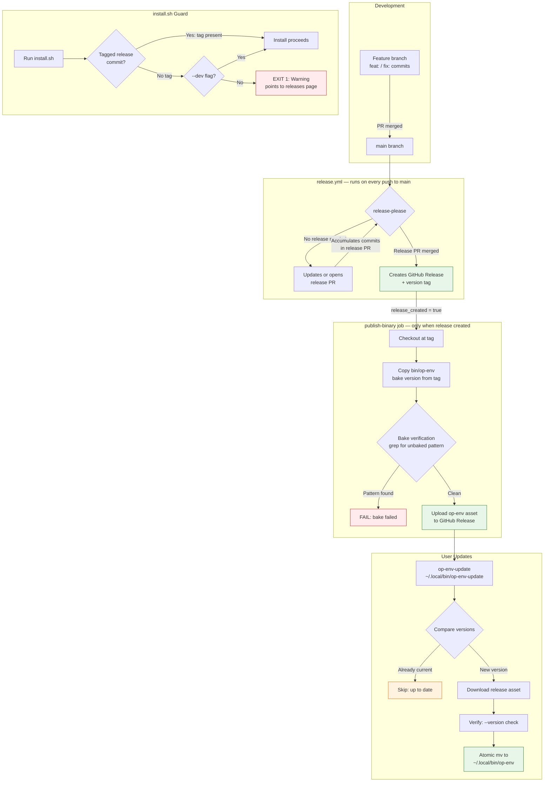

# Release-First Pipeline

Production binaries come exclusively from GitHub Releases, not from the dev working tree.

## Workflow



## What to Watch For

### After every merge to main
- **release-please** runs automatically and opens/updates a release PR (`chore(main): release vX.Y.Z`)
- Only `feat:` and `fix:` commits trigger a version bump
- `chore:`, `docs:`, `refactor:` commits are included in the changelog but don't bump the version on their own

### When you're ready to cut a release
1. Merge the release PR (e.g., `chore(main): release 0.7.0`)
2. release-please creates the GitHub Release + tag
3. `publish-binary` job fires automatically
4. Verify: check the release page for the `op-env` asset

### To update your local install
```bash
op-env-update
```

### If you need to install from dev (not a release)
```bash
./install.sh --dev
```
